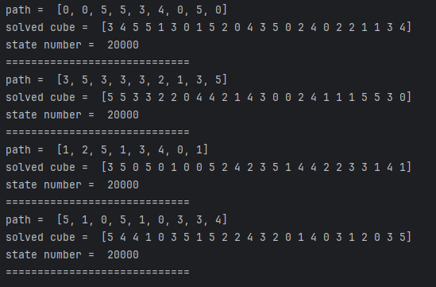
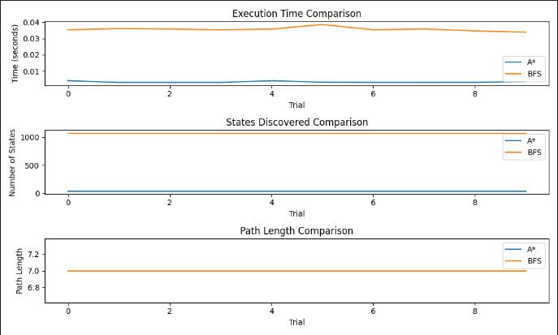
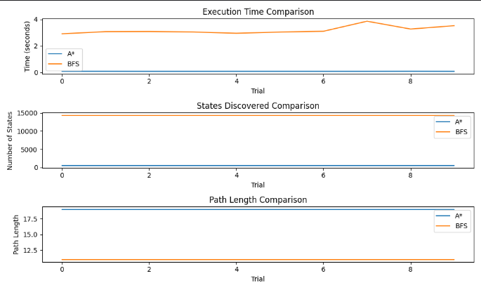
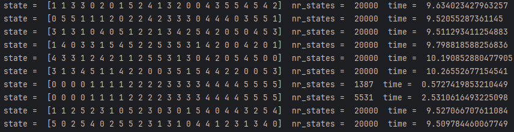

## A* vs BFS
- Case 1 using h1 heuristic  

- Case 2 using h1 heuristic  

- Case 3 using h1 heuristic  

- Case 4 using h1 heuristic  

- Case 1 using h2 heuristic  

- Case 2 using h2 heuristic  

- Case 3 using h2 heuristic  

- Case 4 using h2 heuristic  

Dupa cum putem vedea in grafice, numarul de pasi pana la rezolvarea cubului
este egal atat la A* cat si la BFS, luand in consideratie ca Dijkstra cauta
mereu cel mai scurt drum, nu este nimic uluitor.  
Euristica h1 intoarce numarul de culori care nu sunt la locul lor, pe cand
euristica h2 evalueaza suma distantelor absolute dintre pozitia curenta a
fiecarui cubulet si pozitia sa corespunzatoare in starea obiectiv, apoi 
normalizeaza rezultatul si imparte la 8 (Manhattan distance).  
Euristica h2 este considerata euristica acceptabila, ba mai mult, este 
considerata cea mai eficienta euristica pentru cubul rubik.  

Vorbind de euristica h1, nu sunt sigur ca aste acceptabila, cu toate ca nu
am gasit un contra argument care ar face-o neacceptabila.  

Cu toate ca m-am asteptat ca algoritmul A* sa fie mai rapid si sa foloseasca
mai putine stari decat BFS, putem vedea in grafice ca acest lucru nu se intampla
nice pe unul din teste, cu ambele euristici. Luand in consideratie ca h2 este
considerata una dintre cele mai bune euristici pentru estimarea pasilor pana
la rezolvarea cubului, pot face concluzia ca algoritmul BFS in cazul dat este
mai eficient. Nu pot spune acelasi lucru despre cubul 3x3x3 sau mai mare, dar in
cazul cubului 2x2x2 BFS este mai rapid. Problema poate veni de la euristica, 
pentru ca din observatiile mele, aceasta prezice corect numarul de mutari
pana la rezolvarea cubului daca au ramas maxim 5 mutari, si asta este o problema
,pentru ca eu nu vreau pentru o stare a cubului cu distanta minima de 14 mutari
pana la rezolvare euristica sa-mi intoarca valoare 5, la fel cum o face cu un 
cub care este in realitate la distanta de 5 miscari.  
De asemenea am observat ca A* si BFS mereu imi gasesc o rezolvare a cubului,
acesta fiind un comportament asteptat, pentru ca aceasta fac un backtraking care
va rula pana nu gaseste solutia daca aceasta exista, pentru ca aceasta poate sa
nu existe pentru un cub la care a fost intors un cubulet.

## MCTS
Am incercat sa reprezint cumva in grafice rezultatele de la toate configuratiile
insa graficile sunt greu citibile din cauza rezultatelor diferite, de aceea am 
luat decizia sa fac comparatie si statistica proprie.  
 Pentru testare am folosind acelasi seed pentru ca mcts este un algoritm care se bazeaza pe random, si vreau sa dau conditii egale pentru toate cazurile.Voi teste pe 4 seeduri diferite pentru a ma asigura ca raspunsul unei configuratii este cat de cat acelasi.

### Euristica h2(Manhattan)
Testarea se face pe seed-urile 10, 20, 30, 40  
Prima linie din output
### Case 1
- c = 0.1 ; buget = 1000
Rata de succes 1/4
- c = 0.1 ; buget = 5000
Rata de succes 2/4
- c = 0.1 ; buget = 10000
Rata de succes 3/4
- c = 0.1 ; buget = 20000 
Rata de succes 3/4  
 

- c = 0.5 ; buget = 1000
Rata de succes 1/4
- c = 0.5 ; buget = 5000
Rata de succes 1/4
- c = 0.5 ; buget = 10000
Rata de succes 3/4
- c = 0.5 ; buget = 20000
Rata de succes 4/4  
  

### Case 2
- c = 0.1 ; buget = 1000
Rata de succes 0/4
- c = 0.1 ; buget = 5000
Rata de succes 1/4
- c = 0.1 ; buget = 10000
Rata de succes 2/4
- c = 0.1 ; buget = 20000
Rata de succes 2/4  
  

- c = 0.5 ; buget = 1000
Rata de succes 0/4
- c = 0.5 ; buget = 5000
Rata de succes 2/4
- c = 0.5 ; buget = 10000
Rata de succes 3/4
- c = 0.5 ; buget = 20000
Rata de succes 3/4  
  

### Case 3
- c = 0.1 ; buget = 1000
Rata de succes 0/4
- c = 0.1 ; buget = 5000
Rata de succes 0/4
- c = 0.1 ; buget = 10000
Rata de succes 0/4
- c = 0.1 ; buget = 20000
Rata de succes 0/4  
  

- c = 0.5 ; buget = 1000
Rata de succes 0/4
- c = 0.5 ; buget = 5000
Rata de succes 0/4
- c = 0.5 ; buget = 10000
Rata de succes 0/4
- c = 0.5 ; buget = 20000
Rata de succes 0/4  
 

### Case 4
- c = 0.1 ; buget = 1000
Rata de succes 0/4
- c = 0.1 ; buget = 5000
Rata de succes 1/4
- c = 0.1 ; buget = 10000
Rata de succes 1/4
- c = 0.1 ; buget = 20000
Rata de succes 1/4  
  

- c = 0.5 ; buget = 1000
Rata de succes 0/4
- c = 0.5 ; buget = 5000
Rata de succes 0/4
- c = 0.5 ; buget = 10000
Rata de succes 1/4
- c = 0.5 ; buget = 20000
Rata de succes 1/4  
 

Dupa cum putem observa, testul 1 trece cu o rata de 25%-50% pentru buget
mic si 75%-100% pentru buget mare. Testul 2 trece cu o rata de 50% pentru
constanta mica si buget mare, si o rata de 75% pentru constanta mare si 
buget mare. Testul 3 nu gaseste nici o solutie pentru nici o configuratie
din pacate, cu toate ca la rularea a 10 teste cu seed random, rata este de 30%  

.  
Testul 4 ne da o rata de 25% pentru bugete mari, atat pentru
constanta 0.1 cat si pentru 0.5.   
Nu consider ca Monte Carlo este un algoritm potrivit pentru rezolvarea
cubului rubik din cateva motive. Acest algoritm depinde foarte mult de
euristica pentru ca UCB alege starile preferate in dependenta de Q(reward)
si de (N) numarul de vizitari ale nodului. Pe care o prefera mai tare este
data de constanta c, insa dupa cum putem vedea in teste aceasta strategie nu
are succes, si motivul principal este euristica care nu poate estima numarul 
de miscari pana cand cubul este facut. Dupa cum am mai spus, aceasta euristica
estimeaza corect pana la 5 miscari distanta, insa mai departe prezice gresit,
ceea ce face ca algoritmul sa creada ca o stare care se afla intr-adevar la
distanta de 5 miscari este considerata la fel de buna ca o miscare care este 
in realitate la 14 miscari distanta, insa euristica spune ca se afla la 5
miscari. Am incercat sa optimizez algoritmul, si in faza de simulare sa nu 
aleg random miscarile, dar sa fac doar miscari care ma duc intr-o stare care
nu a fost deja parcursa, astfel facand simularea de 14 depth, miscarile se aleg
in asa mod ca toate starile sa fie diferite. Aceasta optimizare nu permite sa
fara o miscare , apoi opusa acesteia care ar aduce-o in starea initiala, si 
aceste 2 miscari nu ar avea nici un sens. De asemenea nu permite nici cicluri,
care ar putea duce cubul intr-o stare deja parcursa. Aceasta optimizare a adus
un pic de performanta, in sensul ca atunci cand se alegeau miscarile random
case 3 avea rata de succes 0% , pe cand acum are 30%, insa oricum nu a fost 
destul de eficienta pentru ca 30% este o rata prea mica pentru un asa algoritm.

Ca concluzie vreau sa spun ca in exemple nu am aratat foarte multe rulari,si
poate 4 teste e prea putin, insa sunt sigur ca c=0.5 si bugetul 20000 este cea
mai buna configuratie, si pentru case1 rata de succes este de 90%-100%, case2
70%-80%, case3 30%, case4 10%.

### Comparatia MCTS cu A* si BFS
Nu cred ca ar fi corect sa compar MCTS cu A* sau BFS, pentru ca cele din urma
macar aduc un rezulat satisfacator de fiecare data, pe cand mcts este stabil 
si rapid pentru stari care sunt foarte aproape de starea finala. Chiar si 
din punct de vedere a starilor, nu pot spune ca Monte carlo este mai bun, pentru
ca daca ne uitam la case1 cu A* si BFS vedem 300-600 stari pe cand in monte
carlo 300-20000, deci un range foarte mare. Si iarasi, problema cea mai mare
in monte carlo este euristica, pentru ca daca ai o euristica proasta, programul
se invata gresit din simularile trecute, si odata ce a ales un nod gresit de la 
inceput, isi complica mai tare starea, pe cand A* chiar si cu o euristica 
proasta, dar acceptabila, in worst case face un backtracking care oricum ajunge
la solutie. Eu cred ca am facut algoritmul monte carlo destul de optimizat, si
teoretic ar putea exista o euristica care ar putea da rezultate mai 
satisfacatoare, insa din pacate nu am gasit una (si luand in consideratie ca manhattan distance este considerata una din cele mai bune euristici, este 
foarte greu sa gasesti o euristica mai putin buna, care s-ar potrivi mai bine
pentru monte carlo). Am incercat sa rulez si cu euristica h1, insa rezultatele
sunt mai proaste decat cu h2.

## Pattern Database
Acest algoritm face o parcurgere bfs pana la andancimea 7 si salveaza starea
curenta si path-ul de move-uri care s-a facut (se insereaza de fiecare data
la inceput si se inverseaza miscare, adica se face opusa ei, pentru a face
path-ul de la starea cubului pana la cubul rezolvat). Stiu ca ar fi trebuit
sa salvez doar distanta pana la rezolvare, dar am considerat ca ar fi mai
bine sa salvez si path-un in cazul in care voi avea nevoie de el vreodata.  
Aceasta baza de date este o imbunatire pentru euristica, pentru ca cel putin
pentru o distanta de 7 miscari, voi sti exact numarul de pasi pana la rezolvare.

### A*

- Case 1 using h3 heuristic  
  

- Case 2 using h3 heuristic  
  

- Case 3 using h3 heuristic  
  

- Case 4 using h3 heuristic  
  

Dupa cum putea vedea in testare, A* cu euristica h3 functioneaza mult mai bine
decat euristica h1, ceea ce confirma inca o data ca euristica foarte mult influenteaza
alegerile pe care le face algoritmul. Dupa cum vedem in grafice, si daca am face o 
comparatie cu rezulatele de mai devreme (cu h1), atat timpul de executie, cat si numarul
de stari a scazut foarte mult. In grafic nu se observa foarte bine numarul de stari pe
care le returneaza, insa pentru cazul 1 returneaza 27 stari iar pentru cazul 4 returneaza
566 stari, comparativ fata de bfs, o imbunatatire foarte buna pentru A*. Initial m-am 
asteptam ca A* sa aiba o performanta inalta doar pentru cazurile 1 si 2, pentru ca 
starea lor initiala se afla in baza de date si era si ceva normal sa se intample. Cazurile
3 si 4 apeleaza mai intai euristica h1, insa o folosesc doar pana ajung intr-o stare care
se afla in baza de date, iar de acolo deja se cunosc pasii exacti pana la rezolvare.
De aceea cazul 4 are 566 stari, pentru ca initial creaza niste stari conform euristicii h1
iar dupa un timp, estimarea mutarilor ramase devine 100% corecta, intrucat folosim deja
euristica h3, altfel spus, avem nevoie de cateva miscari random care ne-ar apropia de
solutie pana la distanta 7, apoi euristica h3 ne ajuta sa ajungem mai usor la rezultat.
Probabil ca acesta este si motivul pentru care path length (miscarile care rezolva cubul)
a devenit mai mare, pentru ca datorita euristii h1, initial nu se garanteaza ca se aleg
cele mai bune miscari, pana nu ajungem la distanta 7 de rezultat.

## MCTS cu h3 vs A* cu h3

- Case 1 using h3 heuristic  
  
Success = 100% 

- Case 2 using h3 heuristic  
  
Success = 70%

- Case 3 using h3 heuristic  
  
Success = 20%

- Case 4 using h3 heuristic  
  
Success = 0%  

Din pacate nu pot spune ca euristica h3 a imbunatatit algoritmul Monte Carlo pentru
rezolvarea cubului. Dupa cum putea vedea in teste, rezultatele sunt aproximativ egale
cu cele de la manhattan. Spre deosebire , h3 a avut un impact foarte mare pentru A*.

# Concluzie
In aceasta tema a trebuit sa fac 3 algoritmi pentru rezolvarea cubului rubik. Algoritmul
BFS , A* care e un BFS care foloseste euristica, si teoretic ar trebui sa fie mai bun
pentru ca acesta isi poate da seama mai devreme daca a facut o alegere gresita, pe cand
BFS nu isi poate da seama, si asa si s-a intamplat cu euristica h3. A* a devenit mult mai
rapid si numarul de stari a scazut foarte mult, cu toate ca am observat ca solutia pe care
mi-a dat-o A* rezolva cubul, dar nu o face in cel mai scurt mod, de aceea trebuie sa alege
un compromis intre performanta, timp si lungimea rezultatului. Monte Carlo insa din pacate
nu ne poate da o rata mare de rezolvare nici pentru una din cele 3 euristici. Acest lucru
se datoreaza faptului ca acesta face alegerile conform unei formule matematice, UCB care
alege mereu miscarea care are probabilitatea mai mare sa fie corecta, in urma simularilor
pe care le-a facut mai devreme, deci teoretic MCTS alege mereu statistic, insa aceasta nu
mereu este cea mai buna decizie. Sunt sigur ca MCTS ar lucra mult mai bine cu o euristica
care ar intoarce exact de fiecare data numarul de pasi pana la rezolvare. Deci daca am 
crea o baza de date mai mare, spre exemplu de distanta 14, acesta ar lucra mult mai bine, 
insa aceasta ar necesita mai multa memorie. Da, putem spune ca popularea acestei baze de 
date ar dura foarte mult, insa asta ar fi doar pentru o singura data, daca o vom salva 
undeva. Probabil ca Monte Carlo nu este cel mai potrivit algoritm pentru rezolvarea
cubului rubik, mai degraba pentru jocurile unde sunt implicati mai mult de un jucator.  
BFS a reusit sa isi arate performanta pentru o euristica mai putin buna. Pentru o
euristica buna , A* a fost mult mai rapid decat cele 2, insa am pierdut din lungimea
rezultatului. Dupa parerea mea, A* este cel mai potrivit algoritm pentru rezolvarea
acestei probleme.

